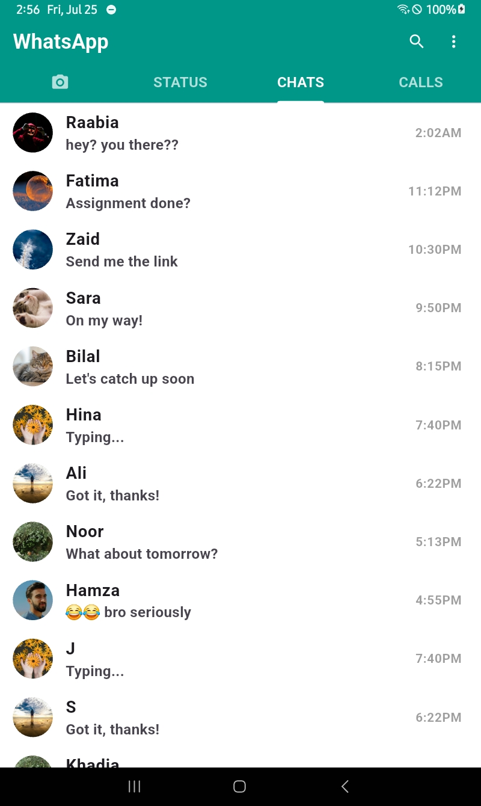

#  WhatsApp Clone - Flutter

A beautiful and responsive WhatsApp UI clone built using Flutter. This project is created for learning purposes and covers navigation, tab management, custom widgets, and data-driven UI using `ListView.builder`.

## 🚀 Features

- WhatsApp-style TabBar with:
  - Camera
  - Status
  - Chats
  - Calls
- Clean and organized folder structure
- Dynamic Chats list using separate data model and `ListView.builder`
- Custom themes and consistent styling

## 🧠 Concepts Used

| Concept            | Description |
|--------------------|-------------|
| `StatefulWidget`   | To handle dynamic UI updates |
| `ListView.builder` | Efficient list rendering of chat items |
| `DefaultTabController` | To manage tabs easily |
| `ThemeData`        | To define light and dark themes |
| `CircleAvatar`     | To display user images |

## 🖼 Screenshots

